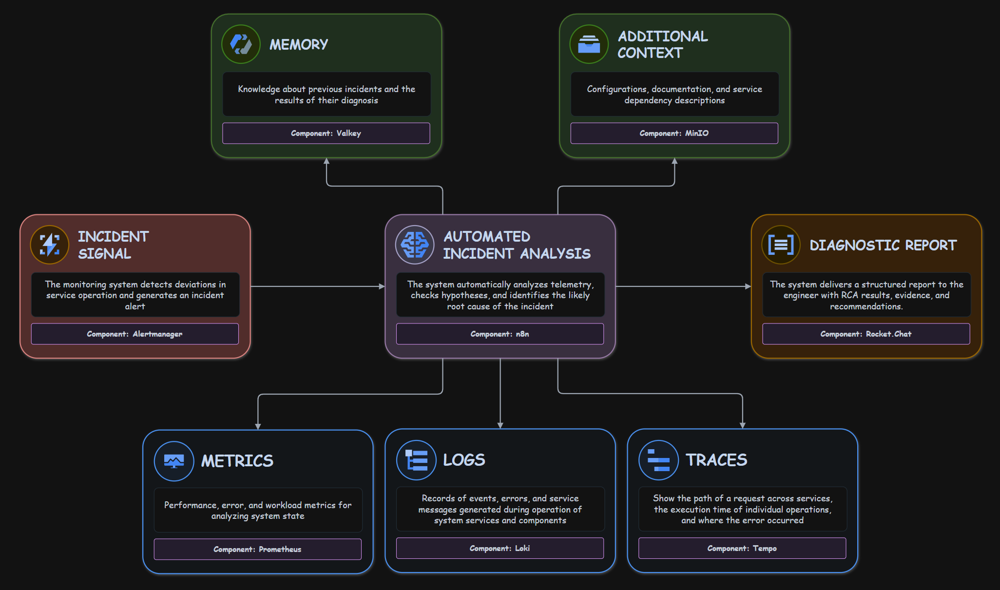

# o11y Agent
`o11y-agent` is an AI Assistant that automatically diagnoses incidents, performs root cause analysis, and provides actionable guidance for SREs, DevOps and On-Call Engineers.

### Features
- **No Code**: The agent is developed based on [n8n](https://n8n.io), allowing users customize it without needing to write code.
- **Observability**: The agent can use [Loki](https://grafana.com/oss/loki/) and [Tempo](https://grafana.com/oss/tempo) to gather information about the system and its components.
- **Context**: The agent can be provided with custom context stored on [MinIO](https://min.io).
- **Memory**: The agent can use memory from [Valkey](https://valkey.io) to remember previous investigations.

### Documentation
1. **[Overview](docs/overview.md)**
2. **[Architecture](docs/architecture.md)**
3. **[Deployment](docs/deployment.md)**
4. **[Credentials](docs/credentials.md)**
5. **[Evaluations](docs/evaluations.md)**
6. **[Services](docs/services)**  
7. **[Scenarios](docs/scenarios)** 

### Workflow
o11y Agent automates incident diagnosis through a streamlined workflow:
1. **Incident Reception**: Receives incident alerts from the observability system.
2. **Context Enrichment**: Retrieves historical memory and contextual data from stores.
3. **Telemetry Retrieval**: Fetches relevant metrics, logs, and traces from the observability system.
4. **AI-Driven Analysis**: Leverages AI models to correlate telemetry data and perform RCA.
5. **Report Generation**: Produces a structured diagnostic report.
6. **Incident Notification**: Sends analysis results to on-call engineers via notification systems.

