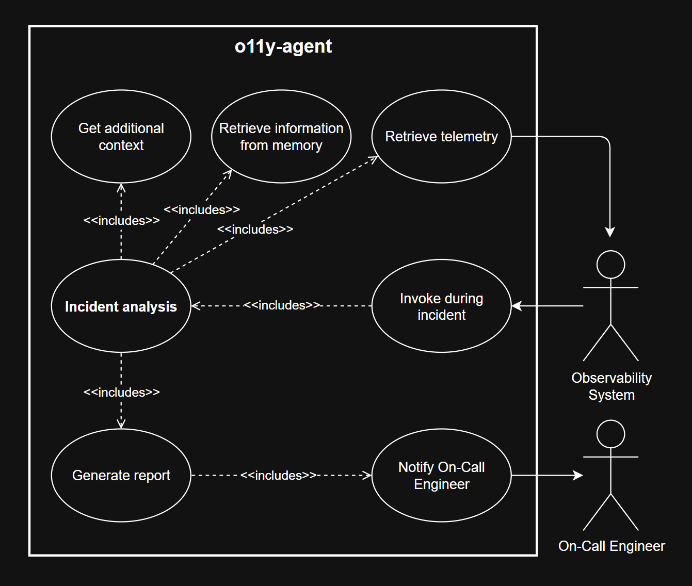
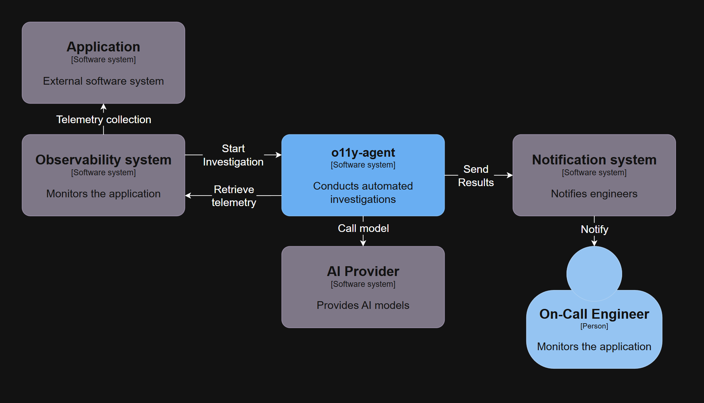
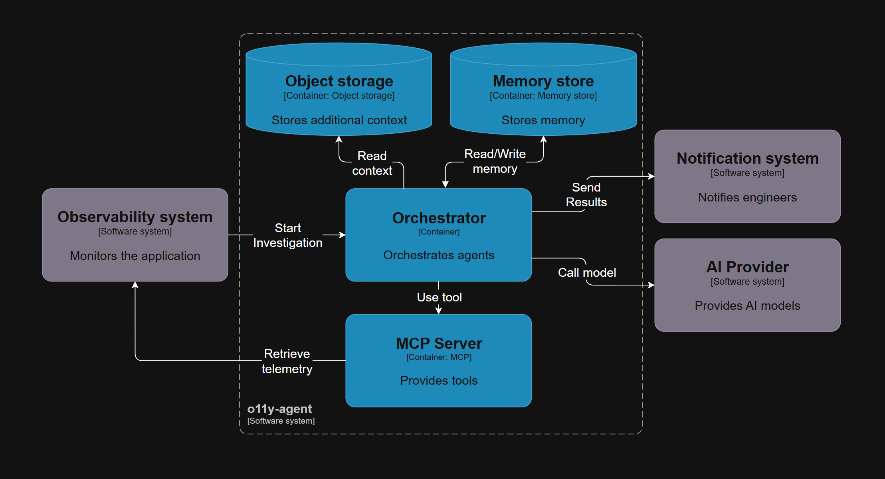
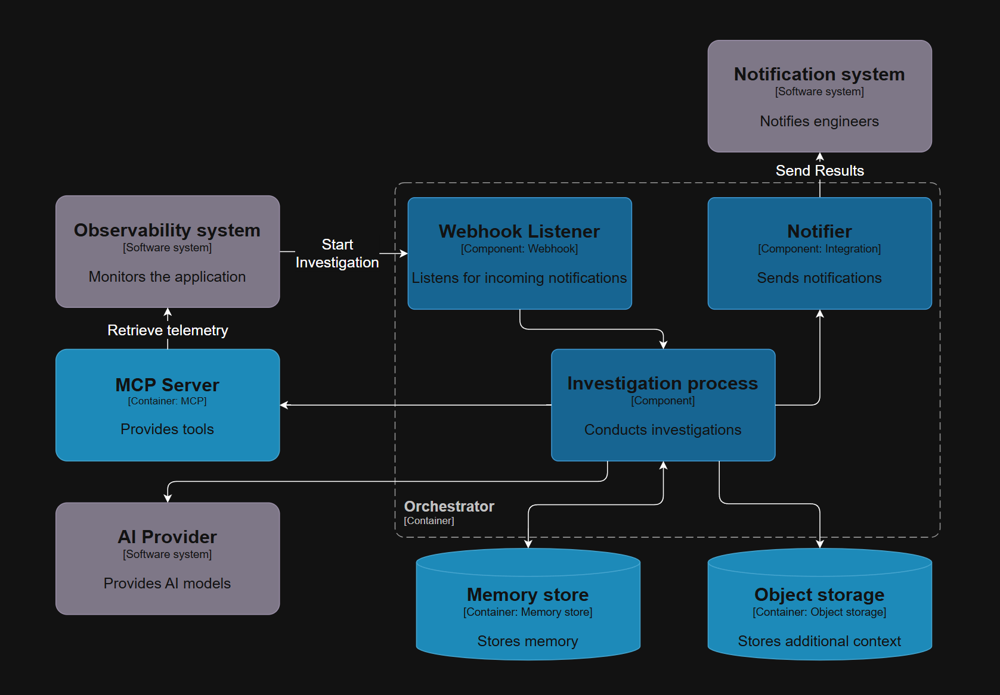

## Architecture
o11y Agent is an event-driven incident response agent that automates telemetry collection, correlates metrics, logs, traces, and uses AI to produce root-cause analyses and remediation guidance.

### Use-Case
o11y Agent is an intelligent incident response agent that automates root cause analysis by retrieving telemetry, correlating multi-source data, performing incident analysis, and notifying the on-call engineers with structured diagnostic reports.

### C4 - Context
o11y Agent is triggered by an observability system detecting incidents, retrieves telemetry data for analysis, calls AI models for root cause determination, and sends results to alerting systems that notify on-call engineers.

### C4 - Container
o11y Agent comprises an orchestrator that coordinates investigation workflows, utilizing object and memory stores, integrating with an MCP server for tools, calling AI providers for analysis, and sending results to alerting systems.

### C4 - Component
o11y Agent's investigation workflow is initiated by a webhook listener, which triggers the investigation process that uses tools from MCP server and AI models for analysis, and sending results through a notifier to the alerting system.

