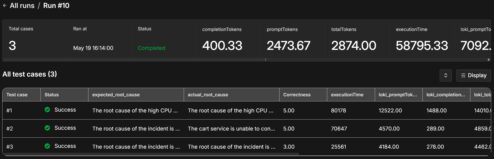
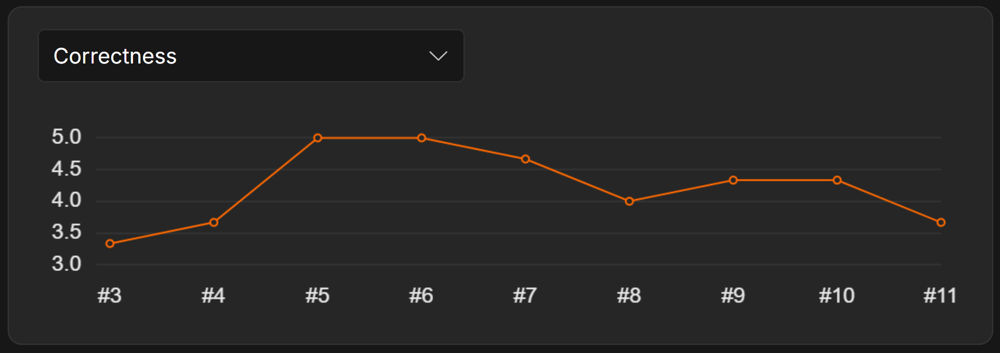
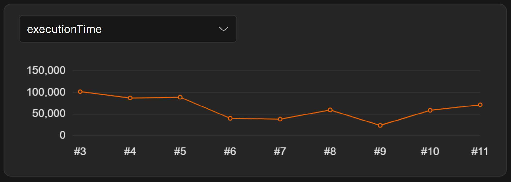
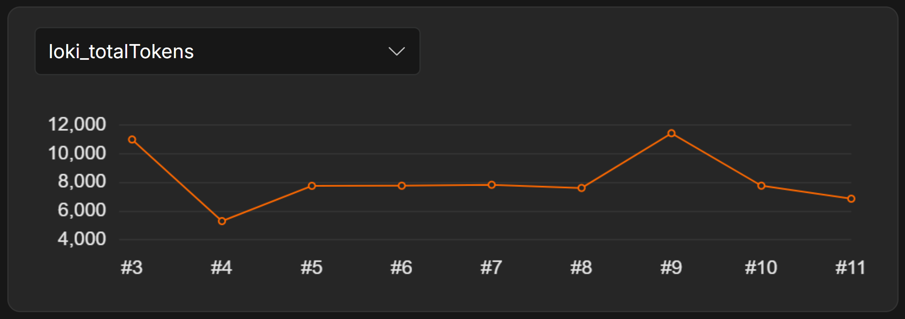
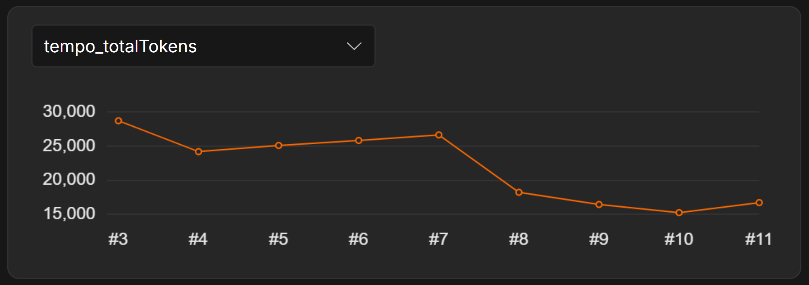

## Evaluations
Evaluations are used to assess the performance of the AI agent in diagnosing incidents and providing insights.

### Prerequisites
In order to run an evaluation, we first need to generate telemetry data for the agent.
1. Deploy the agent using the [deployment guide](./deployment.md).  
2. Register [community edition](https://docs.n8n.io/deploy/host-n8n/community-edition-features#registered-community-edition) to enable the evaluation feature.
3. Go to the [scenarios](./scenarios) to learn how to generate telemetry data.
4. Make note of executions to retrieve Alert's JSON.  

### Prepare Data Table
After generating telemetry data, we need to prepare a data table.
1. Select `Data Tables` section in [n8n](https://n8n.o11y.local) and open `evaluations` table.
2. Copy the Alert's JSON from the `Alert` node in the execution history of the `agent` workflow.
2. Paste Alert's JSON into the `alert_json` column.

### Run Evaluation
After preparing the data table, we can run the evaluation.
1. Go to the `Evaluations` section in the agent workflow.
2. Start evaluation process by clicking the button.
3. Wait a few minutes for the evaluation to complete and check the results.

### Evaluation Runs
Each run is a collection of test cases that are executed to evaluate the performance of the AI agent.  
After running an evaluation, the system will calculate the average metrics for all test cases and display the results.

### Evaluation Metrics
`Correctness` - shows the degree to which the system's conclusion matches the actual cause of the incident. 

`Execution Time` - shows the time taken by the system to reach a conclusion.

`Total Tokens` - shows the total number of tokens used by the system to reach a conclusion.

