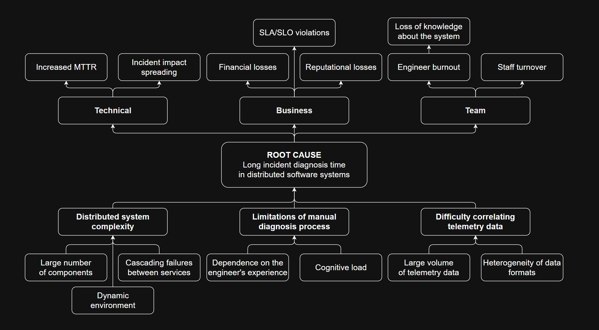
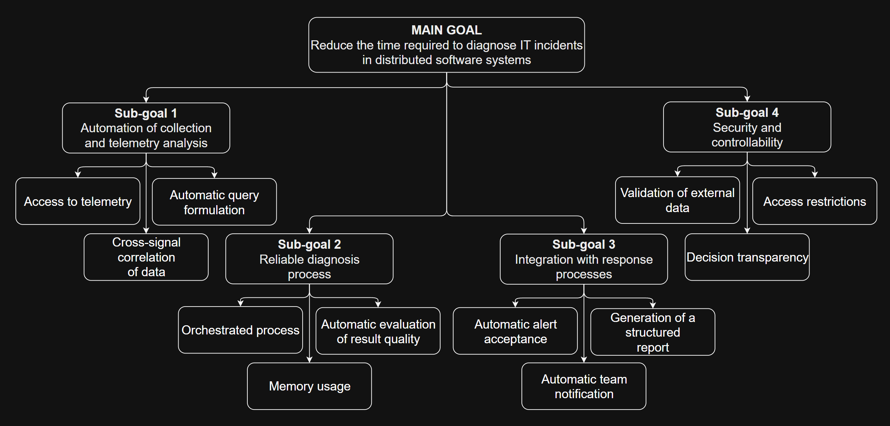

## Overview
The o11y Agent project addresses a critical challenge in modern distributed systems: the inability to quickly diagnose incidents in complex, multi-component environments. By leveraging AI-driven observability, we aim to automate incident diagnosis, reduce diagnostic overhead, and enable rapid resolution while preserving system reliability and engineer well-being.

### Problems
In distributed software systems, prolonged incident diagnosis directly increases MTTR and SLA violations, resulting in significant financial impact and reputational damage. Manual diagnosis workflows are constrained by system complexity, high-volume telemetry, and fragmented data sources, creating cognitive overload and accelerating engineer burnout.

### Objectives
We need to reduce the time required to diagnose IT incidents in distributed software systems through automated telemetry analysis, reliable diagnosis processes, and secure, transparent decision-making.

