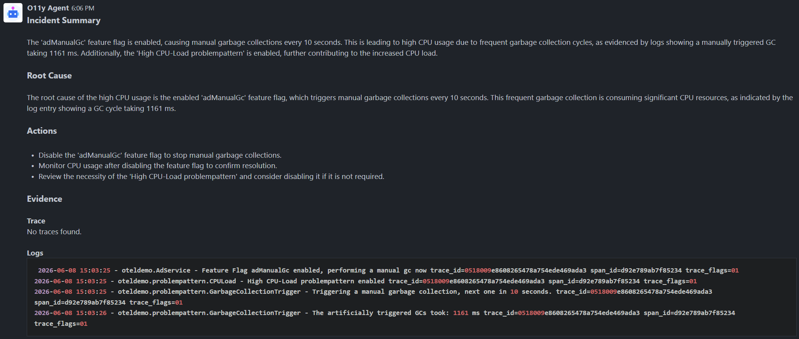

## Complex
In this scenario, we test the o11y Agent's ability to diagnose an issue based on multiple errors.

### Steps
1. Open [Feature Flags](https://otel-demo.o11y.local/feature) and enable the following flags:
    - `adFailure`- Generate an error for GetAds 1/10th of the time.
    - `adManualGc` - Trigger full manual garbage collections in the ad service.
    - `adHighCpu`- Trigger high cpu load in the ad service.
2. Open [Grafana Dashboard](https://grafana.o11y.local) and wait for the `Ad High CPU Usage` alert to trigger.  
You can find the observability panels in the `Ad` section.
3. Open [Alerts Channel](https://rocket.o11y.local/Alerts) and wait for the alert notification to arrive.  

After some time, the o11y Agent will post a report with insights about the issue.

### Example Report
