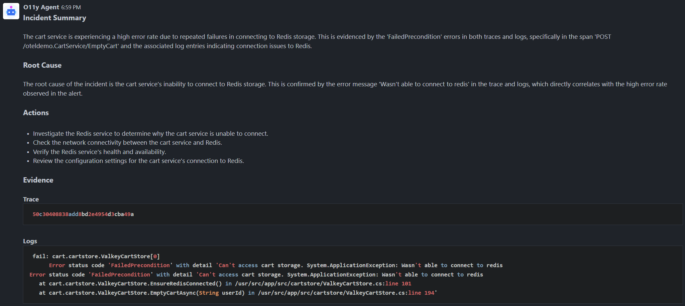

## Simple
In this scenario, we test the o11y Agent's ability to diagnose an issue based on one error.

### Steps
1. Open [Feature Flags](https://otel-demo.o11y.local/feature) and enable the following flags:
    - `cartFailure` - Generate an error whenever EmptyCart is called
2. Open [Grafana Dashboard](https://grafana.o11y.local) and wait for the `Cart High Error Rate` alert to trigger.  
**Note:** You can find the observability panels in the `Cart` section.
3. Open [Alerts Channel](https://rocket.o11y.local/Alerts) and wait for the alert notification to arrive.  

After some time, the o11y Agent will post a report with insights about the issue.

### Example Report
